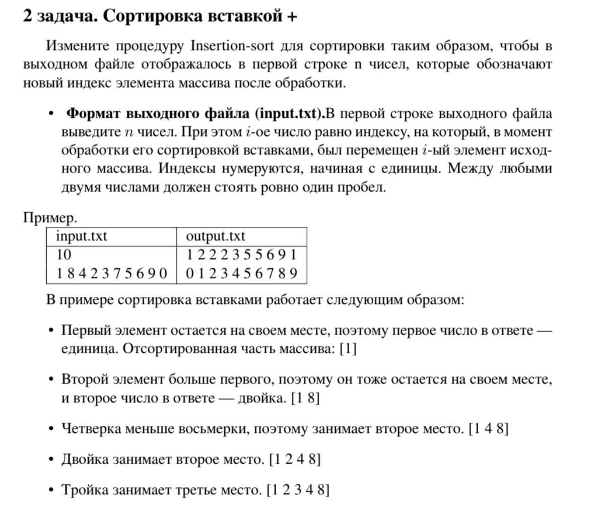

# Лабораторная работа №1
### Вариант №6

### Задания

### Полезные статьи и лекция
[Лекция 1.1](https://drive.google.com/drive/folders/1vY2y0xDkw2D3lqEfpw0X4IDJxICBS5bh)

[Insertion Sort](https://habr.com/ru/articles/181271/)

[Big O](https://habr.com/ru/articles/782608/)

